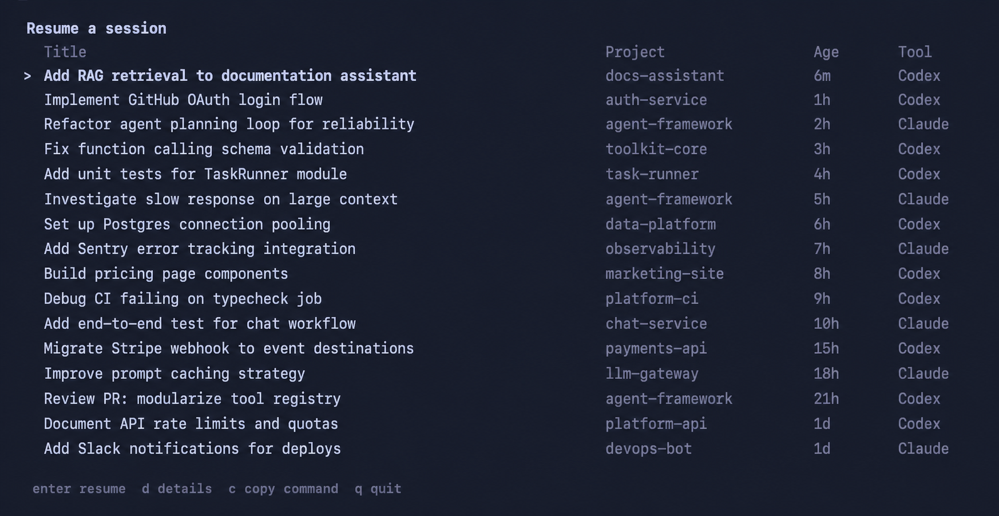

# Resumer



Resumer is a tiny terminal picker for getting back into recent Codex and Claude Code sessions without spelunking through hidden state directories, copying opaque IDs, or guessing which project a conversation belonged to.

It gives your agent history the thing it has been missing: a fast, readable resume screen.

## Why Resumer?

Agent work tends to sprawl across projects, worktrees, laptops, tmux panes, and late-night "what was I doing?" sessions. Codex and Claude Code both keep enough local state to resume, but the raw files are not meant to be browsed by humans.

Resumer normalizes that state into one practical list:

- session titles first, because that is how you remember the work
- compact project names instead of repeated full paths
- relative ages like `6m`, `1h`, and `2d`
- Codex and Claude Code in one picker
- details on demand when you need the exact ID, source file, or resume command
- mobile-friendly rendering for narrow terminals, including Moshi on iPhone

## Install

```sh
go install github.com/pejmanjohn/resumer/cmd/resumer@latest
```

Resumer requires Go 1.26 or newer. `go install` writes binaries to `GOBIN`, or to `$(go env GOPATH)/bin` when `GOBIN` is not set. Make sure that directory is on your `PATH`:

```sh
export PATH="$(go env GOPATH)/bin:$PATH"
```

For zsh, add it permanently:

```sh
echo 'export PATH="$HOME/go/bin:$PATH"' >> ~/.zshrc
exec zsh
```

Verify the installed binary directly if your shell still cannot find it:

```sh
"$(go env GOPATH)/bin/resumer" --help
```

## Usage

```sh
resumer                         # pick from Codex and Claude Code sessions
resumer codex                   # Codex sessions only
resumer claude                  # Claude Code sessions only
resumer --cwd                   # prefer sessions under the current directory
resumer --tmux                  # resume inside a stable tmux session
resumer --print                 # print the selected resume command
resumer list --json             # scriptable JSON output
```

Inside the picker:

```text
up/down or j/k   move
enter            resume
d                show details
c                copy resume command
q or esc         quit
```

## What It Finds

By default, Resumer reads the local session stores used by Codex and Claude Code:

```text
~/.codex/session_index.jsonl
~/.codex/sessions
~/.claude/projects
```

It enriches index entries with transcript metadata when available, then hides internal/noisy rows by default. Use `--all` when you want to inspect everything, including sidechain, subagent, or index-only sessions.

## Tmux And Mobile

`resumer --tmux` launches the selected resume command in a stable, project-aware tmux session:

```sh
tmux new-session -A -s <resumer-session-name> <resume-command>
```

That pairs well with remote mobile terminals. On narrow screens, Resumer switches to a compact two-line layout so titles stay readable and metadata stays close by instead of stretching across a desktop-width table.

## JSON

For scripts and other tools:

```sh
resumer list --json
```

Example shape:

```json
{
  "sessions": [
    {
      "harness": "codex",
      "id": "019dd26c-0f78-7dc1-91f8-f8c2a8f4c515",
      "title": "Prepare production launch",
      "project_path": "/Users/you/code/app",
      "updated_at": "2026-04-28T04:49:55Z",
      "command": "codex resume 019dd26c-0f78-7dc1-91f8-f8c2a8f4c515 --cd /Users/you/code/app"
    }
  ]
}
```

Diagnostics and human-readable errors go to stderr, so JSON stdout stays clean.

## Configuration

Override discovery paths with environment variables:

```sh
RESUMER_CODEX_INDEX_PATH=/path/to/session_index.jsonl
RESUMER_CODEX_SESSIONS_PATH=/path/to/codex/sessions
RESUMER_CLAUDE_PROJECTS_PATH=/path/to/claude/projects
```

## Safety

Resumer is read-only with respect to Codex and Claude Code session storage. It discovers local session files, ranks normalized session cards in memory, and then runs, prints, or copies the harness resume command.

It does not mutate transcripts, rewrite harness state, or maintain its own session database.

## Development

```sh
go test ./...
go run ./cmd/resumer --help
```

## License

MIT
