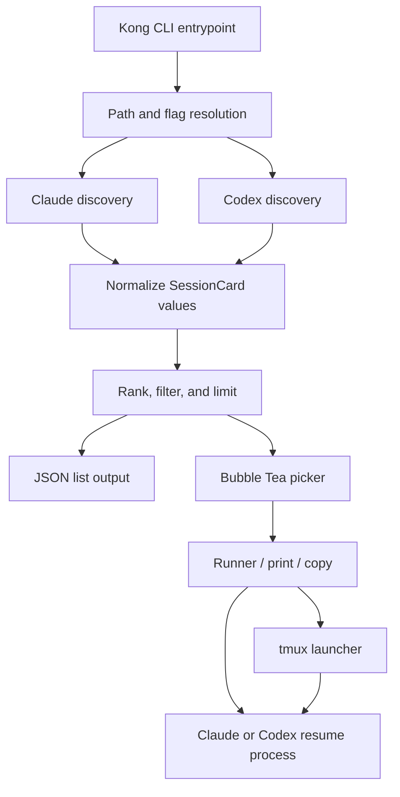
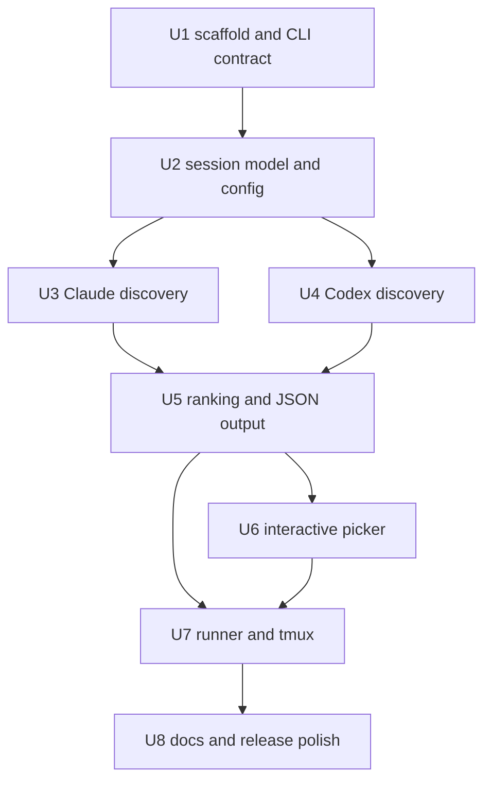

# feat: Build Resumer session resume CLI

## Overview

Build Resumer as a small Go CLI that discovers recent Claude Code and Codex sessions, presents a polished human-first terminal picker by default, and resumes the selected session through the correct harness command. The MVP also keeps a scriptable path through JSON output and `--print`, without mutating harness session state or introducing a custom session database.

This is greenfield work in the current repository: the only existing repo artifact is `session-resume-cli-design.md`. The implementation should follow the design sketch as the source of product truth and use the `gogcli`-style shape it calls out: `cmd/` plus `internal/`, Kong command definitions, stable exit behavior, human-friendly defaults, and machine-readable output where it does not compromise the default TUI.

---

## Problem Frame

Users regularly need to resume existing Claude Code and Codex sessions but currently have to remember opaque session IDs or dig through hidden harness state. Resumer should make the common case fast: run `resumer`, recognize the right recent session from meaningful metadata, and return the terminal to Claude or Codex as if the user typed the resume command manually.

The plan focuses on the MVP described in `session-resume-cli-design.md`: Claude and Codex discovery, normalized session cards, recent-session ranking, an interactive Bubble Tea picker, JSON list output, print/copy behavior, and optional tmux launch for mosh-friendly continuation. Later search, richer config commands, additional harnesses, and destructive tmux dashboard actions stay out of scope.

---

## Requirements Trace

- R1. Running `resumer` with no subcommand opens an interactive picker across Claude Code and Codex sessions.
- R2. `resumer claude` and `resumer codex` filter the interactive picker to one harness.
- R3. Claude discovery reads the primary session index and falls back to transcript JSONL discovery when the index is unavailable or incomplete.
- R4. Codex discovery reads the session index and enriches from transcript metadata where available.
- R5. Session data is normalized into a shared card model with harness, ID, title, project path, timestamps, first prompt preview, model, and source path.
- R6. Default display is human-first: recent activity, harness, project path, title, and first prompt preview are visible; IDs and source paths stay in details/debug views.
- R7. Default ranking sorts by most recent activity, limits noisy output, hides known Claude sidechain/internal sessions unless `--all` is requested, and can bias current working directory sessions when requested.
- R8. Selection launches the correct harness resume command, using project-aware execution for Claude when project path is available.
- R9. `--print` prints the selected resume command instead of executing it; the picker copy action copies that same command.
- R10. `resumer list --json` emits stable machine-readable normalized session data.
- R11. Optional `--tmux` starts the selected resume command inside a stable Resumer-named tmux session and attaches to it; existing matching Resumer tmux sessions are attached instead of duplicated.
- R12. Resumer never mutates Claude or Codex session state and does not create its own session database.
- R13. Errors and exit codes are stable enough for scripts and agents to distinguish usage errors, discovery failures, empty results, canceled selection, and launch failures.
- R14. The MVP stays small: no daemon, no full config subsystem, no OpenClaw integration, no additional harnesses, no fuzzy search, and no `resumer tmux` management dashboard.

---

## Scope Boundaries

- No mutation of Claude Code or Codex session files.
- No custom session database or background daemon.
- No support for Gemini, Cursor, OpenCode, OpenClaw, or other harnesses in MVP.
- No fuzzy search, `resumer search`, `resumer last`, or fork mode in MVP.
- No full `resumer config` command system in MVP; use defaults, environment overrides, and flags.
- No `resumer tmux` dashboard in MVP beyond attach/reuse behavior for tmux sessions created through `--tmux`.
- No kill or rename actions for tmux sessions in MVP.
- No attempt to move an already-running non-tmux Claude/Codex process into tmux.

### Deferred to Follow-Up Work

- Plain/TSV output and `resumer command <session-id>`: design the formatter boundary now, but ship only `list --json` and interactive `--print` unless implementation cost is negligible.
- Search/filter UI: keep the picker model ready for future filtering, but do not add `/` search in MVP.
- Config file and `resumer config` commands: defer until env vars and flags create real friction.
- Richer Codex metadata from future SQLite/index sources: keep discovery interfaces extensible, but do not depend on unpublished storage beyond current index and transcript JSONL.
- Phone reconnect dashboard: defer `resumer tmux` attach/kill/rename list UI to a later iteration.

---

## Context & Research

### Relevant Code and Patterns

- `session-resume-cli-design.md`: source of product requirements, MVP cut, package layout, default UX, and non-goals.
- Current repository: no Go module, no git metadata, no implementation files, no `docs/brainstorms/`, no `docs/solutions/`, and no repo-local AGENTS guidance beyond the instructions supplied in this session.
- Local harness presence check: Go, Claude Code, Codex CLI, and tmux are installed on the planning machine, so the MVP can assume these commands exist for local manual verification while still handling missing binaries gracefully.
- Local CLI spot check: current Codex `resume` supports `--cd <DIR>`, so Codex cards with enriched project paths can resume into that workspace instead of only relying on the caller's current directory.
- Local schema spot check without reading prompt content:
  - Claude session indexes expose top-level `entries`, `originalPath`, and `version`, with entry fields matching the design sketch including `sessionId`, `summary`, `firstPrompt`, `created`, `modified`, `projectPath`, `fullPath`, `gitBranch`, `messageCount`, and `isSidechain`.
  - Codex session index lines expose `id`, `thread_name`, and `updated_at`.
  - Codex transcript JSONL includes `session_meta` payloads with `cwd`, `git`, `id`, `model_provider`, and timestamp metadata that can enrich project path/model when present.
- `gogcli` reference style: public repo uses a `cmd/<binary>/main.go` entrypoint, `internal/cmd` command package, Kong parser, global JSON/plain flags, explicit error formatting, and stable `main` exit mapping.

### Institutional Learnings

- No `docs/solutions/` directory exists in this repository, so there are no local institutional learnings to carry forward.

### External References

- [Bubble Tea package docs](https://pkg.go.dev/github.com/charmbracelet/bubbletea): Elm-style TUI model/update/view architecture, key messages, window resize messages, program options, and terminal cleanup behavior.
- [Bubble Tea v2 package docs](https://pkg.go.dev/github.com/charmbracelet/bubbletea/v2): useful current reference for clipboard and terminal capabilities, but the MVP should not absorb v2 API churn unless the implementation pass verifies a stable release.
- [Lip Gloss package docs](https://pkg.go.dev/github.com/charmbracelet/lipgloss): terminal styling, width/height measurement, layout joining, color degradation, and no-color behavior for non-TTY output.
- [Kong package docs](https://pkg.go.dev/github.com/alecthomas/kong): struct-driven CLI parser with parser construction and command execution patterns.
- [Go `os/exec` docs](https://pkg.go.dev/os/exec@go1.26.1): `os/exec` does not invoke a shell or expand shell syntax by default, which should shape safe harness command execution.
- [steipete/gogcli](https://github.com/steipete/gogcli): named inspiration for small Go CLI layout, Kong usage, stable output modes, and agent-friendly command behavior.

---

## Key Technical Decisions

- Use Go with a conventional `cmd/resumer` plus `internal/*` layout: This matches the source design and keeps the binary entrypoint thin while making discovery, ranking, picker, runner, output, and error formatting testable independently.
- Use Kong for command parsing: The design explicitly asks for Kong-style command definitions, and `gogcli` demonstrates the intended style of struct-based commands, global flags, and centralized exit handling.
- Prefer stable dependency majors for the MVP: Use the stable Bubble Tea v1 import path, current stable Lip Gloss, and current stable Kong unless implementation-time package metadata shows Bubble Tea v2 has reached a stable release. Native v2 clipboard support is useful but not worth making the whole TUI depend on beta APIs.
- Treat harness session storage as external, versionless input: Claude and Codex session indexes are not Resumer-owned APIs, so parsers should be tolerant of missing fields, unknown fields, malformed records, and absent indexes.
- Normalize before ranking or rendering: Discovery packages should return harness-specific raw records only long enough to map into `session.SessionCard`; ranking, output, picker, and runner should consume normalized data.
- Keep the picker custom instead of starting from `bubbles/list`: The card layout is multi-line and needs exact control over row height, truncation, details display, and footer actions, as the design sketch states.
- Separate selection from launch: The TUI should return a selected session/action; command printing, copy feedback, exec replacement, tmux launch, and error handling should live outside the picker model where they can be unit-tested without terminal state.
- Prefer direct process argv for normal resume execution: Use non-shell process construction for Claude/Codex commands wherever possible, because Go `os/exec` preserves argv boundaries and avoids shell expansion surprises.
- Use project-aware Codex resumes when enrichment provides a cwd: Claude already uses a working directory for project-aware resumes; Codex should add its resume `--cd` option when `ProjectPath` is known and fall back to plain `codex resume <session-id>` when it is not.
- Use `syscall.Exec` only where it improves the default Unix experience and after the TUI has fully released terminal control: Keep a spawn fallback for unsupported platforms or failed exec replacement.
- Treat tmux as an explicit runner mode: `--tmux` should create/attach named tmux sessions, not change discovery semantics or claim it can capture already-running non-tmux processes.
- Make env vars the only MVP configuration surface: The design explicitly defers a full config command system; path/env resolution should be centralized so a later config file can slot in without rewriting discovery.
- Preserve privacy in logs and debug output: Session prompts and source paths can be sensitive, so debug output should summarize counts, paths, and parse failures without dumping transcript content.

---

## Open Questions

### Resolved During Planning

- Should the MVP include a persistent database? No. The origin explicitly says no custom session database; all data should come from harness state at runtime.
- Should search be central to MVP? No. The origin says recency sorting plus strong cards should make recent sessions scannable; search is deferred.
- Should Resumer support every harness on day one? No. The MVP supports Claude Code and Codex only.
- Should tmux mode try to capture an already-running non-tmux process? No. The origin calls this brittle; the plan only starts new resume commands inside tmux or attaches to Resumer-created sessions.
- Should IDs be shown in default rows? No. They are needed for details/debug and machine output, but the default card should optimize for recognition.

### Deferred to Implementation

- Exact copy-to-clipboard backend inside the adapter: use Bubble Tea support only if the chosen stable major provides it; otherwise use a narrow platform adapter with graceful unsupported-terminal failure. The picker should only request "copy this command" and display success/failure.
- Exact Claude transcript fallback extraction rules: characterize with fixtures from sanitized sample records before finalizing which message types count as the first real user prompt.
- Exact Codex transcript file lookup from a session ID: derive from current session index/transcript naming during implementation and keep failures non-fatal enrichment misses.
- Exact recent-active warning threshold: the design includes the warning concept, but the MVP should only add it if it does not interrupt the normal resume flow unnecessarily.

---

## Output Structure

This tree shows the expected greenfield shape. It is a scope declaration, not a constraint; implementation may adjust file names if that improves cohesion.

```text
.
+-- go.mod
+-- go.sum
+-- README.md
+-- cmd/
|   +-- resumer/
|       +-- main.go
+-- internal/
    +-- cmd/
    |   +-- root.go
    |   +-- root_test.go
    |   +-- exit.go
    |   +-- exit_test.go
    +-- config/
    |   +-- paths.go
    |   +-- paths_test.go
    +-- clipboard/
    |   +-- clipboard.go
    |   +-- clipboard_test.go
    +-- discovery/
    |   +-- claude.go
    |   +-- claude_test.go
    |   +-- codex.go
    |   +-- codex_test.go
    |   +-- testdata/
    +-- errfmt/
    |   +-- errfmt.go
    |   +-- errfmt_test.go
    +-- outfmt/
    |   +-- json.go
    |   +-- json_test.go
    +-- picker/
    |   +-- picker.go
    |   +-- render.go
    |   +-- picker_test.go
    +-- rank/
    |   +-- rank.go
    |   +-- rank_test.go
    +-- runner/
    |   +-- command.go
    |   +-- runner.go
    |   +-- tmux.go
    |   +-- runner_test.go
    +-- session/
        +-- session.go
        +-- session_test.go
```

---

## High-Level Technical Design

> *This illustrates the intended approach and is directional guidance for review, not implementation specification. The implementing agent should treat it as context, not code to reproduce.*



Implementation unit dependencies:



---

## Implementation Units

- U1. **Scaffold the Go CLI shell**

**Goal:** Create the Go module, binary entrypoint, Kong command skeleton, stable exit mapping, and top-level command/flag contract for the MVP.

**Requirements:** R1, R2, R9, R10, R11, R13, R14

**Dependencies:** None

**Files:**
- Create: `go.mod`
- Create: `go.sum`
- Create: `cmd/resumer/main.go`
- Create: `internal/cmd/root.go`
- Create: `internal/cmd/root_test.go`
- Create: `internal/cmd/exit.go`
- Create: `internal/cmd/exit_test.go`
- Create: `internal/errfmt/errfmt.go`
- Create: `internal/errfmt/errfmt_test.go`

**Approach:**
- Define the MVP CLI surface in one command package: default picker, `claude`, `codex`, `list --json`, `--print`, `--tmux`, `--limit`, `--all`, `--cwd`, and `--debug`.
- Follow the `gogcli` pattern of a thin `main` that delegates to `internal/cmd` and maps returned errors to stable exit codes.
- Keep global output mode and debug handling centralized so JSON output never gets mixed with human error decoration on stdout.
- Return a distinct canceled-selection result so quitting the picker is not treated as a crash.

**Execution note:** Start with command parsing and exit-code tests so later units can wire behavior into a stable CLI contract.

**Patterns to follow:**
- `session-resume-cli-design.md` package layout.
- `steipete/gogcli` thin `cmd/<binary>/main.go`, Kong parser, output flags, and error formatting structure.

**Test scenarios:**
- Happy path: parsing no args selects the all-harness interactive mode with default limit and no JSON output.
- Happy path: parsing `claude` and `codex` selects the correct harness filter without changing the default interactive action.
- Happy path: parsing `list --json` selects non-interactive JSON list mode.
- Happy path: parsing `--print` preserves interactive selection but switches the post-selection action from execute to print.
- Happy path: parsing `--tmux` selects tmux runner mode without changing discovery or ranking.
- Edge case: `--limit 0` or a negative limit returns a usage error with the usage exit code.
- Edge case: mutually incompatible output flags, if any are added during implementation, fail as usage errors before discovery.
- Error path: command execution returns a launch failure and `main` maps it to the documented launch exit code.
- Error path: canceled picker maps to the documented cancel exit code and does not print a stack trace.

**Verification:**
- The CLI contract is test-covered before discovery or TUI implementation.
- Exit code constants and formatted errors are documented in code comments or README prose, not scattered across command handlers.

---

- U2. **Define normalized session and configuration boundaries**

**Goal:** Create the shared `SessionCard` model, harness enum/value handling, resume command representation, runtime path resolution, and env var override behavior used by discovery, output, picker, and runner.

**Requirements:** R5, R6, R7, R8, R9, R11, R12, R13

**Dependencies:** U1

**Files:**
- Create: `internal/session/session.go`
- Create: `internal/session/session_test.go`
- Create: `internal/config/paths.go`
- Create: `internal/config/paths_test.go`
- Modify: `internal/cmd/root.go`
- Modify: `internal/cmd/root_test.go`

**Approach:**
- Model normalized sessions independently from raw Claude/Codex records.
- Represent resume commands as argv plus optional working directory, with a separate display string for details/print/copy.
- Centralize default path resolution and env var overrides for Claude projects, Codex sessions, Codex index, default tmux mode, and host hint. The MVP env names should match the source sketch: `RESUMER_CLAUDE_PROJECTS_PATH`, `RESUMER_CODEX_SESSIONS_PATH`, `RESUMER_CODEX_INDEX_PATH`, `RESUMER_DEFAULT_TMUX`, and `RESUMER_TMUX_HOST_HINT`.
- Use timestamps as parsed `time.Time` values with enough original-source context to sort reliably and explain missing data in debug mode.
- Keep source path in the normalized model but mark it as details/debug/machine data, not default row data.

**Patterns to follow:**
- `session-resume-cli-design.md` `SessionCard` fields and default menu priority.
- Go standard library path and time handling; avoid ad hoc string sorting for timestamps.

**Test scenarios:**
- Happy path: a normalized Claude card with project path builds a command representation that includes the project working directory and Claude resume argv.
- Happy path: a normalized Claude card without project path builds a Claude resume command without a working directory.
- Happy path: a normalized Codex card with project path builds a Codex resume command with session ID and Codex cwd option.
- Happy path: a normalized Codex card without project path builds a plain Codex resume command from the session ID.
- Happy path: env vars override default discovery paths without affecting unrelated defaults.
- Edge case: missing title falls back to first prompt preview, then session ID tail, without producing an empty row title.
- Edge case: missing `UpdatedAt` falls back to `CreatedAt` for ranking eligibility while preserving that updated time is unknown.
- Error path: invalid env path values or unparseable config booleans produce stable config errors rather than panics.
- Integration: command display string and argv representation stay consistent for print/copy/details views.

**Verification:**
- All downstream packages can depend on `internal/session` and `internal/config` without importing harness-specific parser details.

---

- U3. **Implement Claude Code discovery**

**Goal:** Discover Claude Code sessions from the primary session index, fall back to transcript JSONL when needed, normalize records, and filter sidechain/internal sessions by default.

**Requirements:** R3, R5, R6, R7, R8, R12, R13

**Dependencies:** U2

**Files:**
- Create: `internal/discovery/claude.go`
- Create: `internal/discovery/claude_test.go`
- Create: `internal/discovery/testdata/claude-sessions-index.json`
- Create: `internal/discovery/testdata/claude-session.jsonl`
- Modify: `internal/session/session.go`

**Approach:**
- Parse the primary Claude index shape as tolerant JSON, handling both top-level metadata and nested entries.
- Preserve useful fields from the origin design: session ID, summary/title, first prompt, message count, created/modified timestamps, git branch, project path, full path, and sidechain marker.
- For fallback JSONL, scan line-by-line and extract session ID, cwd/project path, first real user prompt, created/modified timestamps, sidechain marker, and source path where available.
- Do not fail the whole discovery run because one project index or transcript is malformed; collect debug diagnostics and continue with valid records.
- Hide sidechain sessions by default when the marker is present; include them under `--all`.

**Execution note:** Add sanitized fixture coverage before parser implementation so behavior is pinned against known index and transcript shapes.

**Patterns to follow:**
- Local schema spot check from current Claude indexes, without copying real prompt content into fixtures.
- Go streaming JSONL parsing for transcript fallback rather than loading large transcript files wholesale.

**Test scenarios:**
- Happy path: a sessions index entry with summary, first prompt, project path, and modified timestamp becomes a complete Claude `SessionCard`.
- Happy path: when an index file is missing, a JSONL transcript with user messages produces a card with first prompt and source path.
- Happy path: multiple project directories produce a combined list without duplicate session IDs.
- Edge case: `isSidechain: true` sessions are omitted by default and included when the include-all option is set.
- Edge case: missing summary falls back to first prompt preview.
- Edge case: malformed timestamp leaves the session discoverable if another timestamp is usable and records a debug diagnostic.
- Error path: unreadable project directory returns a discovery warning/diagnostic while other directories still contribute sessions.
- Error path: malformed JSON index falls back to JSONL discovery instead of aborting all Claude discovery.
- Integration: Claude cards preserve project path so runner can build the project-aware resume command.

**Verification:**
- Claude discovery can run against fixture indexes and transcripts with no dependency on real hidden state.
- Debug diagnostics are available for malformed sources, but normal human output remains uncluttered.

---

- U4. **Implement Codex discovery and enrichment**

**Goal:** Discover Codex sessions from the session index, enrich project/model metadata from transcript JSONL when available, and normalize into shared session cards.

**Requirements:** R4, R5, R6, R7, R8, R10, R12, R13

**Dependencies:** U2

**Files:**
- Create: `internal/discovery/codex.go`
- Create: `internal/discovery/codex_test.go`
- Create: `internal/discovery/testdata/codex-session-index.jsonl`
- Create: `internal/discovery/testdata/codex-transcript.jsonl`
- Modify: `internal/session/session.go`

**Approach:**
- Parse the Codex index as JSONL, expecting at least `id`, `thread_name`, and `updated_at` while tolerating extra or missing fields.
- Use transcript metadata enrichment when a transcript can be found for the session: cwd/project path, model/provider, source path, and created timestamp where available.
- Keep transcript enrichment best-effort; index records should still appear when transcript lookup fails.
- Avoid depending on future Codex SQLite or alternate storage in MVP, but isolate transcript lookup so a later source can be added.
- Do not read or expose transcript message text by default beyond the first-prompt enrichment explicitly needed for cards; when absent, leave `FirstPrompt` empty rather than guessing.

**Execution note:** Add characterization fixtures for index-only and index-plus-transcript cases before implementing enrichment.

**Patterns to follow:**
- Local schema spot check from current Codex index and transcript event keys.
- The same `SessionCard` normalization contract used by Claude discovery.

**Test scenarios:**
- Happy path: an index line with ID, thread name, and updated timestamp becomes a Codex card with title and updated time.
- Happy path: a matching transcript `session_meta` enriches a Codex card with cwd/project path, source path, and model/provider metadata.
- Happy path: index-only sessions are still returned when transcript files are missing.
- Edge case: blank or missing `thread_name` falls back to a stable title derived from session ID.
- Edge case: duplicate index records for a session keep the most recently updated record.
- Edge case: malformed JSONL lines are skipped with diagnostics while valid lines continue.
- Error path: missing Codex index yields an empty Codex result plus a clear discovery diagnostic, not a panic.
- Integration: `resumer list --json` can include Codex sessions with and without enrichment using the same schema.

**Verification:**
- Codex discovery is useful with only the current session index and improves gracefully as transcript metadata is available.

---

- U5. **Add ranking, filtering, and JSON list output**

**Goal:** Combine sessions from selected harnesses, apply limit/all/cwd ranking behavior, and expose a stable JSON list output for scripts and agents.

**Requirements:** R2, R5, R6, R7, R10, R12, R13, R14

**Dependencies:** U3, U4

**Files:**
- Create: `internal/rank/rank.go`
- Create: `internal/rank/rank_test.go`
- Create: `internal/outfmt/json.go`
- Create: `internal/outfmt/json_test.go`
- Modify: `internal/cmd/root.go`
- Modify: `internal/cmd/root_test.go`
- Modify: `internal/session/session.go`

**Approach:**
- Rank by updated time descending by default, using created time only as a fallback.
- Apply harness filters before ranking and limit after filtering.
- Use `--all` to include sidechain/internal sessions and older/noisy records that default mode hides.
- Implement `--cwd` as a ranking boost, not a hard filter, so users still see recent sessions outside the current repo.
- Define a JSON schema from normalized `SessionCard` fields and keep it stable: harness, id, title, project_path, updated_at, created_at, first_prompt, model, source_path, command, and diagnostic metadata where appropriate.
- Keep JSON on stdout and diagnostics/errors on stderr.

**Patterns to follow:**
- `gogcli` distinction between human output and machine output modes.
- The source design's default menu priority and default limit behavior.

**Test scenarios:**
- Happy path: mixed Claude and Codex sessions are sorted by updated time descending.
- Happy path: `--limit 50` returns at most 50 sessions after filtering.
- Happy path: `resumer list --json` emits mixed Claude and Codex sessions under the default all-harness mode.
- Happy path: `--cwd` ranks sessions under the current directory above equally recent unrelated sessions without excluding unrelated sessions.
- Edge case: sessions with equal timestamps sort deterministically by harness and title or ID.
- Edge case: default mode hides sidechain/internal sessions while `--all` includes them.
- Edge case: empty discovery results produce a stable empty JSON list for `list --json`.
- Error path: JSON encoding failure is surfaced as an output error and does not fall back to partial human output.
- Integration: JSON output includes command display strings that match `--print` for the same session.

**Verification:**
- Scriptable output is deterministic and does not depend on terminal width or color settings.

---

- U6. **Build the interactive picker**

**Goal:** Implement the default Bubble Tea/Lip Gloss TUI with multi-line session cards, keyboard navigation, details toggle, copy action, resize handling, empty state, and selection return.

**Requirements:** R1, R2, R5, R6, R7, R8, R9, R13

**Dependencies:** U5

**Files:**
- Create: `internal/picker/picker.go`
- Create: `internal/picker/render.go`
- Create: `internal/picker/picker_test.go`
- Modify: `internal/cmd/root.go`
- Modify: `internal/session/session.go`

**Approach:**
- Implement a custom picker model that owns cursor, scroll offset, terminal dimensions, details state, copy status, selected session/action, and error state.
- Render compact multi-line cards with harness, relative time, project path, title, and first prompt preview; keep ID/source/model in details.
- Support `up`/`down` and `j`/`k` navigation, `enter` selection, `d` details, `c` copy command, and `q`/Escape/Ctrl-C cancel.
- Use Lip Gloss for style composition, width measurement, truncation, and color behavior; avoid hard-coding terminal widths.
- Keep copy as an action result or command request, not a direct dependency from rendering to OS clipboard implementation.
- Ensure no-session state tells the user what was searched and how to try `--all` or path env overrides without dumping internal paths by default.

**Technical design:** Directional state flow for the picker:

```text
ranked sessions -> picker model
key/window messages -> update cursor/details/copy/selection
view -> render cards/details/footer from current model
selected/canceled action -> command layer decides print/execute/tmux
```

**Patterns to follow:**
- Bubble Tea model/update/view separation.
- Lip Gloss rendering utilities for measuring and truncating terminal strings.
- Source design's default row format and footer actions.

**Test scenarios:**
- Happy path: initial render displays the first ranked session selected and includes footer controls.
- Happy path: down/up and `j`/`k` move selection without moving beyond list bounds.
- Happy path: Enter returns the selected session and quits the program cleanly.
- Happy path: `d` toggles details for the selected session and includes ID, created/modified times, source, and resume command.
- Happy path: `c` requests copy of the selected session command and displays success or failure feedback.
- Edge case: terminal resize recomputes truncation without overlapping card text or footer text.
- Edge case: long project paths, long titles, and multi-byte prompt text are truncated cleanly.
- Edge case: empty session list renders an empty state and returns a non-crash empty/canceled outcome.
- Error path: copy failure leaves the picker usable and shows a concise failure state.
- Integration: selection in filtered Claude/Codex modes can only return a session from the requested harness.

**Verification:**
- Picker behavior can be tested through model updates and rendered string snapshots without requiring an actual terminal session.

---

- U7. **Implement resume, print, copy, and tmux runners**

**Goal:** Execute or print the selected resume command, support project-aware Claude resumes, handle Codex resumes, and add explicit tmux launch/attach mode.

**Requirements:** R8, R9, R11, R12, R13, R14

**Dependencies:** U5, U6

**Files:**
- Create: `internal/runner/command.go`
- Create: `internal/runner/runner.go`
- Create: `internal/runner/tmux.go`
- Create: `internal/runner/runner_test.go`
- Create: `internal/clipboard/clipboard.go`
- Create: `internal/clipboard/clipboard_test.go`
- Modify: `internal/cmd/root.go`
- Modify: `internal/session/session.go`
- Modify: `internal/picker/picker.go`

**Approach:**
- Build resume commands from normalized sessions using argv plus optional working directory; render a shell-friendly display string only for humans, details, print, copy, and tmux command text.
- For default resume, release/exit the TUI first, then prefer Unix exec replacement where supported so the terminal becomes the harness process.
- Fall back to spawning the harness with inherited stdin/stdout/stderr when exec replacement is unavailable or inappropriate.
- Detect missing `claude`, `codex`, or `tmux` binaries before trying to launch and surface stable runner errors.
- Implement `--print` as a post-selection runner mode that writes the display command and exits without starting the harness.
- Implement copy through `internal/clipboard` so the picker and runner do not depend on platform-specific clipboard details. Unsupported clipboard environments should return a displayable copy failure, not fail selection or resume.
- Implement `--tmux` with stable names based on harness plus project/title slug, attach if an exact Resumer-created session already exists, and otherwise create then attach.
- Keep tmux process detection best-effort and scoped to Resumer-created names/commands; do not promise to capture unrelated live processes.
- Escape/quote tmux shell command strings carefully because tmux starts a shell command even though normal runner mode should avoid shell interpretation.

**Execution note:** Write command construction and tmux naming tests before wiring actual process launching. Process launching should use injectable interfaces so tests do not start real Claude, Codex, or tmux processes.

**Patterns to follow:**
- Go `os/exec` argv behavior for safe non-shell command execution.
- Source design's tmux naming strategy and phone handoff constraints.

**Test scenarios:**
- Happy path: Claude session with project path launches with that working directory and Claude resume argv.
- Happy path: Claude session without project path launches Claude resume argv with no working directory.
- Happy path: Codex session with project path launches Codex resume argv for the selected ID plus Codex cwd option.
- Happy path: Codex session without project path launches plain Codex resume argv for the selected ID.
- Happy path: `--print` emits exactly the same command shown in details/copy output and starts no process.
- Happy path: `--tmux` generates a stable `resumer-<harness>-<slug>` session name from project/title.
- Happy path: existing matching tmux session causes attach behavior instead of duplicate new-session behavior.
- Edge case: tmux name collision with a non-matching session appends a short deterministic suffix or returns a clear collision decision, depending on implementation choice.
- Edge case: project paths or titles containing spaces/shell metacharacters are safe in display strings and tmux shell command construction.
- Edge case: selected session updated very recently can surface the active-session warning if that warning is implemented in MVP.
- Edge case: unsupported clipboard backend returns a copy failure while preserving the selected session and normal resume behavior.
- Error path: missing harness binary produces a stable launch error before terminal handoff.
- Error path: tmux missing or failing to create a session returns a stable tmux error without mutating session files.
- Integration: runner receives the selected session from the picker and respects root flags `--print` and `--tmux`.

**Verification:**
- Runner tests prove command construction, display strings, error mapping, and tmux naming without executing real harness commands.
- Manual verification can be done against local Claude/Codex/tmux after unit tests pass, but the plan does not depend on manual-only confidence.

---

- U8. **Document usage, constraints, and release-ready behavior**

**Goal:** Add concise user-facing docs and final polish so the MVP is understandable, installable from source, and safe to use around external session state.

**Requirements:** R1, R2, R8, R9, R10, R11, R12, R13, R14

**Dependencies:** U7

**Files:**
- Create: `README.md`
- Modify: `go.mod`
- Modify: `internal/cmd/root.go`
- Modify: `internal/cmd/root_test.go`

**Approach:**
- Document the default interactive flow, harness filters, `list --json`, `--print`, `--tmux`, path env overrides, default limit/all behavior, and non-goals.
- State plainly that Resumer reads harness state but never writes/mutates session files.
- Document exit code categories at a user level, aligned with `internal/cmd/exit.go`.
- Include a short tmux/mosh handoff explanation without promising process capture.
- Keep installation instructions source-based for MVP; Homebrew packaging is deferred.
- Ensure `--help` mirrors README terminology so users see the same mental model in docs and CLI help.

**Patterns to follow:**
- `gogcli` README style: practical command examples, JSON/scriptability callouts, and clear auth/config notes adapted to Resumer's simpler domain.
- Source design's "human-first default, optional machine output" positioning.

**Test scenarios:**
- Happy path: help text includes the MVP commands and flags documented in README.
- Happy path: README command examples map to parser-supported commands/flags.
- Edge case: docs make deferred features clear so users do not expect search, config commands, or tmux dashboard actions in MVP.
- Test expectation: no separate behavioral tests for prose beyond parser/help consistency checks; README should be reviewed manually for accuracy.

**Verification:**
- README and `--help` agree on supported MVP behavior.
- Deferred features are explicitly marked so the tool does not overpromise.

---

## System-Wide Impact

- **Interaction graph:** Command parsing feeds shared config/path resolution, then harness-specific discovery, normalization, ranking, optional output/picker, and finally runner/print/tmux. Discovery must not import picker or runner packages.
- **Error propagation:** Discovery should collect per-source diagnostics where possible; command-level errors should be reserved for invalid usage, total discovery failure where no useful results can be produced, output failures, and launch/tmux failures.
- **State lifecycle risks:** The app reads external harness files that may change while it is scanning. Parsers should tolerate partial reads, malformed lines, missing files, and duplicate records without writing back.
- **API surface parity:** Interactive picker, JSON list output, details pane, print, and copy should all derive command strings and metadata from the same normalized model so they do not drift.
- **Integration coverage:** Fixture-based parser tests prove discovery; runner tests prove command construction; command-level tests should prove the end-to-end composition from filters to ranking/output without launching real harnesses.
- **Privacy and debug surface:** Prompt previews and source paths are useful but sensitive. Default output should show only recognition-critical prompt preview text; debug output should avoid dumping entire transcript lines.
- **External command boundary:** Normal resume execution should use argv-based process construction. tmux mode is the exception that needs shell command text, so quoting there is a high-attention area.
- **Unchanged invariants:** Claude and Codex session files remain read-only. Resumer does not create, migrate, compact, or repair harness data.

---

## Risks & Dependencies

| Risk | Mitigation |
|------|------------|
| Claude/Codex session formats change without notice | Tolerant parsers, fixture tests, best-effort enrichment, debug diagnostics, and no assumption that every field exists |
| Transcript files contain sensitive prompt data | Use sanitized test fixtures, avoid verbose content dumps, show only intended previews, and keep source path/details behind details/debug/machine views |
| tmux command construction introduces shell quoting bugs | Keep normal runner argv-based, isolate tmux command string construction, and test paths/titles with spaces and shell metacharacters |
| TUI rendering breaks on narrow terminals or long paths | Test render output across small widths, centralize truncation, and keep footer/card dimensions stable |
| Missing harness binaries make resume fail late | Detect `claude`, `codex`, and `tmux` availability before handoff and map failures to stable errors |
| `syscall.Exec` leaves terminal in a bad state if called before TUI cleanup | Return selection from picker, let command layer restore/release terminal, then execute runner |
| MVP grows into a config/search/tmux dashboard project | Keep deferred features documented and only build the commands listed in the MVP cut |

---

## Documentation / Operational Notes

- The README should be created as part of the MVP, not deferred, because this is a new CLI with no existing docs.
- There is no database migration, service deployment, or background process rollout.
- Release packaging beyond source install is deferred, but the module and binary path should be compatible with future `go install` and Homebrew packaging.
- The implementation should include sanitized fixture data under `internal/discovery/testdata/`; never commit real local session content.
- If a later GitHub repository is initialized, add CI to run Go tests and formatting checks before publishing.

---

## Success Metrics

- Running `resumer` on a machine with Claude/Codex state shows a useful recent-session picker without manual IDs.
- A user can resume the selected Claude or Codex session through the default path.
- `resumer list --json` gives scripts and agents stable normalized session data.
- `--print` and picker copy produce the same command the runner would execute.
- `--tmux` starts or attaches to a stable Resumer-named tmux session without claiming to capture unrelated processes.
- Session state remains read-only throughout the tool.

---

## Sources & References

- Origin document: [session-resume-cli-design.md](session-resume-cli-design.md)
- External docs: [Bubble Tea](https://pkg.go.dev/github.com/charmbracelet/bubbletea)
- External docs: [Bubble Tea v2](https://pkg.go.dev/github.com/charmbracelet/bubbletea/v2)
- External docs: [Lip Gloss](https://pkg.go.dev/github.com/charmbracelet/lipgloss)
- External docs: [Kong](https://pkg.go.dev/github.com/alecthomas/kong)
- External docs: [Go os/exec](https://pkg.go.dev/os/exec@go1.26.1)
- Reference project: [steipete/gogcli](https://github.com/steipete/gogcli)
